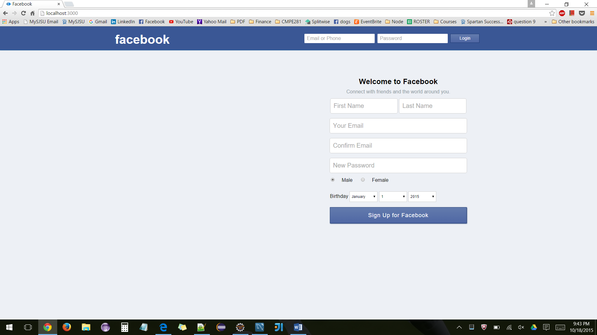
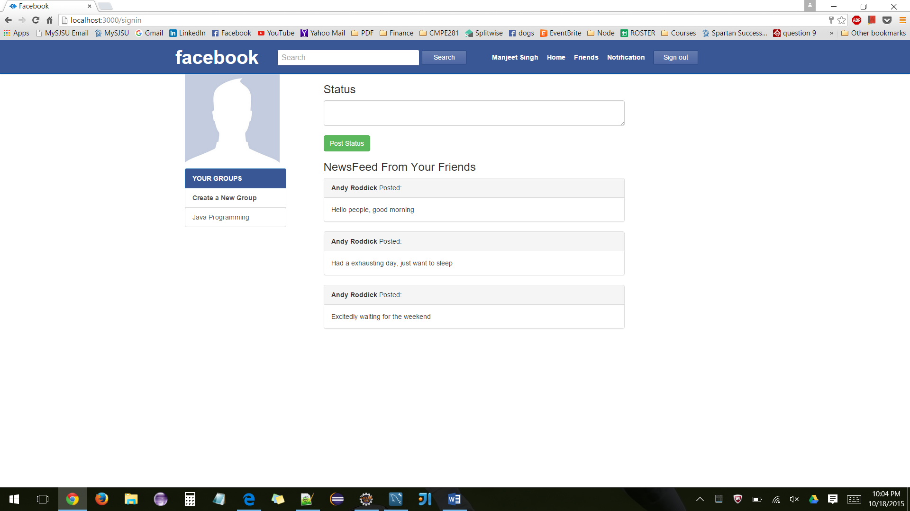
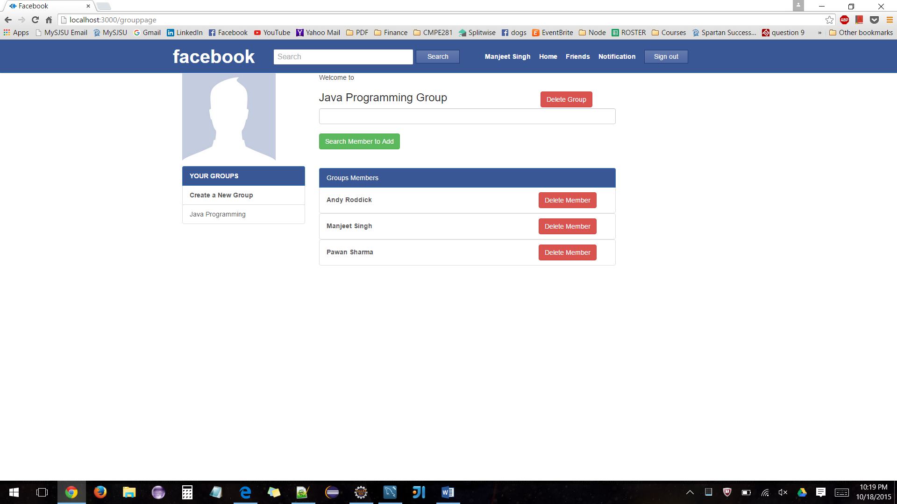

# Social Network Application

## Project Description
► Multi Tier scalable web application which provides features similar to Facebook 
► Features: 
&nbsp;&nbsp;&nbsp;&nbsp;&nbsp;&nbsp;-Users SignIn / SignUp 
&nbsp;&nbsp;&nbsp;&nbsp;&nbsp;&nbsp;-Groups 
&nbsp;&nbsp;&nbsp;&nbsp;&nbsp;&nbsp;-Newsfeed 
&nbsp;&nbsp;&nbsp;&nbsp;&nbsp;&nbsp;-Notification 
&nbsp;&nbsp;&nbsp;&nbsp;&nbsp;&nbsp;-User Profile 
&nbsp;&nbsp;&nbsp;&nbsp;&nbsp;&nbsp;-Friend Request 
► Database Connection Pooling

## Technology Stack
► BackEnd: Node.js, ExpressJS, RESTful Web Service 
► Middleware: RabbitMQ 
► FrontEnd: AngularJS, BootStrap, HTML, CSS 
► Database: MySQL 
► Load and Performance Testing: JMeter 

### Login Page

### Home Page

### Profile Overview Page

### Profile Work Page

### Friend Requests

### Group Page

### Add Member to Group

### Feed from some new friends

